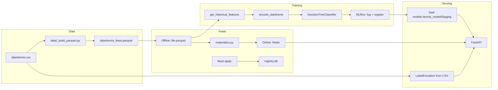

# Tennis Play Prediction — MLOps

End-to-end MLOps for predicting whether weather conditions are suitable to **play tennis**, using the classic 14-row dataset (Outlook, Temperature, Humidity, Wind → Play).

**Stack:** Python 3.11+ (CI uses 3.11; local `python3` is fine), [Feast](https://feast.dev/) (file offline store + Redis online store), [MLflow](https://mlflow.org/) (local tracking + model registry), [FastAPI](https://fastapi.tiangolo.com/) serving, GitHub Actions CI/CD.

No Kubernetes. No Kubeflow.

---

## How everything works

### High-level flow



1. **Data** — `tennis.csv` is the source of truth for schema and categories. `data/_build_parquet.py` label-encodes categoricals (same integer mapping Feast and training rely on) and writes `tennis_feast.parquet` with `day_id`, `event_timestamp`, and encoded feature columns.

2. **Feast** — `feature_store/feature_repo/` defines the entity `day_id` and feature view `tennis_features`. The offline store reads the parquet; `feast apply` registers definitions to `data/registry.db`. **Materialization** copies points-in-time features into **Redis** so you can serve by `day_id`.

3. **Training** (`training/train.py`) — Loads historical rows from Feast for `day_id` 1–14 at `event_timestamp = 2024-01-01 UTC`, runs `encode_dataframe` (second sklearn `LabelEncoder` pass on stringified values — effectively consistent with stored ints), trains `DecisionTreeClassifier(max_depth=3)`, logs metrics to MLflow, registers **`tennis_model`**, and promotes the new version to **`Staging`** if accuracy ≥ `ACCURACY_THRESHOLD` (default `0.80`).

4. **Serving** (`serving/app.py`) — On startup:
   - Loads the sklearn model from **`models:/tennis_model/Staging`** via MLflow.
   - Opens a Feast client for online lookups (Redis).
   - Fits **feature encoders** from `data/tennis.csv` so raw string inputs match the integers the model expects.

   Two prediction modes:
   - **`POST /predict`** — Client sends `day_id`; features are read from the Feast **online store** (must be materialized for that id).
   - **`POST /predict/features`** — Client sends the four weather strings; **no Feast lookup** for features (still requires MLflow for the model artifact).

### Prediction output

| Field | Meaning |
|--------|---------|
| `prediction` | `0` = No, `1` = Yes (matches encoded label after training pipeline) |
| `label` | `"No"` or `"Yes"` |

---

## Project layout

```
mlops/
├── .github/workflows/ci_cd.yml   # CI: unit → data validation → smoke → train (main only)
├── data/
│   ├── tennis.csv                # Raw dataset
│   ├── tennis_feast.parquet      # Generated (do not hand-edit)
│   └── _build_parquet.py         # CSV → parquet builder
├── feature_store/
│   ├── feature_repo/
│   │   ├── feature_store.yaml    # Feast project + Redis + file offline store
│   │   ├── data_sources.py       # Parquet file source (absolute path)
│   │   └── features.py           # Entity + feature view definitions
│   └── materialize.py            # Offline → Redis materialization window
├── training/
│   ├── helpers.py                # Encode, train, deploy gate (pure functions)
│   └── train.py                  # Feast fetch → train → MLflow register
├── serving/
│   └── app.py                    # FastAPI app
├── tests/
│   ├── unit/
│   ├── data_validation/
│   └── smoke/
├── conftest.py                   # Puts repo root on PYTHONPATH for pytest
├── Dockerfile
├── Makefile
├── requirements.txt
└── README.md
```

---

## Prerequisites

| Requirement | Purpose |
|-------------|---------|
| **Python 3.10+** (3.11 recommended) | Runtime |
| **`python3`** on `PATH` | Makefile defaults to `python3` (override: `make train PYTHON=python`) |
| **Redis** on `localhost:6379` | Feast online store |
| **MLflow tracking server** | Training registry + serving loads model from it |

Optional: Docker for Redis (`docker run … redis`).

---

## Commands reference

### Makefile targets

| Command | What it does |
|---------|----------------|
| `make setup` | `pip install -r requirements.txt`, build parquet, run `feast apply` from `feature_store/feature_repo` |
| `make parquet` | Only runs `data/_build_parquet.py` |
| `make materialize` | Runs `feature_store/materialize.py` (writes into Redis for the configured time window) |
| `make test` | `pytest tests/ -v` (no Redis/MLflow required) |
| `make train` | Runs `training/train.py` (needs Feast + MLflow + parquet applied) |
| `make serve` | `uvicorn serving.app:app --reload` |

Override interpreter: `make serve PYTHON=/usr/bin/python3.11`

### One-off commands (equivalent)

```bash
python3 -m pip install -r requirements.txt
python3 data/_build_parquet.py
cd feature_store/feature_repo && feast apply
python3 feature_store/materialize.py          # from repo root
python3 -m pytest tests/ -v
python3 training/train.py
python3 -m uvicorn serving.app:app --reload --host 0.0.0.0 --port 8000
```

### Infrastructure (local)

Start Redis:

```bash
docker run -d --name redis-tennis -p 6379:6379 redis
```

Start MLflow (adjust host/port if needed):

```bash
mlflow server --host 0.0.0.0 --port 5000
```

---

## Environment variables

### Training (`training/train.py`)

| Variable | Default | Description |
|----------|---------|-------------|
| `FEAST_REPO_PATH` | *(unset → `<repo>/feature_store/feature_repo`)* | If set, can be absolute or relative to the **project root** (not the shell cwd) |
| `MLFLOW_TRACKING_URI` | `http://localhost:5000` | MLflow tracking URI |
| `ACCURACY_THRESHOLD` | `0.80` | Minimum accuracy to promote model version to **Staging** |

### Serving (`serving/app.py`)

| Variable | Required | Description |
|----------|----------|-------------|
| `MLFLOW_TRACKING_URI` | **Yes** | Same URI used when training/registering |
| `FEAST_REPO_PATH` | No | Override Feast repo; if unset, resolves to `<repo>/feature_store/feature_repo` (from `paths.py`, **not** the shell cwd) |
| `TENNIS_REFERENCE_CSV` | No | Defaults to `<repo>/data/tennis.csv`; encoders for `/predict/features` |

Example:

```bash
export MLFLOW_TRACKING_URI="http://localhost:5000"
make serve
```

Optional: `export FEAST_REPO_PATH=/absolute/path/to/feature_repo` when not using the default layout.

---

## Local development (full stack)

Run from the **repository root** (`mlops/`).

1. **Install, parquet, Feast registration**

   ```bash
   make setup
   ```

2. **Redis** (must be listening on `localhost:6379` per `feature_store.yaml`)

3. **MLflow** on port 5000 (or set `MLFLOW_TRACKING_URI` to match)

4. **Materialize** features into Redis (required for `POST /predict` by `day_id`)

   ```bash
   make materialize
   ```

5. **Tests** (optional anytime; no Redis/MLflow)

   ```bash
   make test
   ```

6. **Train** and register the model (promotes to Staging if accuracy ≥ threshold)

   ```bash
   export FEAST_REPO_PATH="$PWD/feature_store/feature_repo"
   export MLFLOW_TRACKING_URI="http://localhost:5000"
   make train
   ```

7. **Serve**

   ```bash
   FEAST_REPO_PATH="$PWD/feature_store/feature_repo" \
   MLFLOW_TRACKING_URI="http://localhost:5000" \
   make serve
   ```

8. **Call the API** — see [API & cURL](#api--curl) below.

---

## API & cURL

Base URL in examples: `http://localhost:8000`. For Docker publishing on port 8000, use the same paths.

### `GET /health`

Liveness check.

```bash
curl -sS http://localhost:8000/health
```

Example response:

```json
{"status":"ok"}
```

---

### `POST /predict` — predict by `day_id` (Feast online store)

Looks up encoded features for `day_id` in Redis. Only works for days **1–14** after materialization and if Redis matches the Feast repo you trained with.

**Request body:** `{ "day_id": <int> }`

```bash
curl -sS -X POST http://localhost:8000/predict \
  -H 'Content-Type: application/json' \
  -d '{"day_id": 1}'
```

Example response (day 1 is Sunny / Hot / High / Weak → No):

```json
{"day_id":1,"prediction":0,"label":"No"}
```

More examples:

```bash
curl -sS -X POST http://localhost:8000/predict \
  -H 'Content-Type: application/json' \
  -d '{"day_id": 3}'

curl -sS -X POST http://localhost:8000/predict \
  -H 'Content-Type: application/json' \
  -d '{"day_id": 14}'
```

---

### `POST /predict/features` — predict from raw weather fields

Does **not** query Redis for features. Encodes strings using the same vocabulary as `data/tennis.csv`. Still loads the model from MLflow on startup.

Allowed values (must match CSV exactly):

| Field | Values |
|-------|--------|
| `outlook` | `Sunny`, `Overcast`, `Rain` |
| `temperature` | `Hot`, `Mild`, `Cool` |
| `humidity` | `High`, `Normal` |
| `wind` | `Weak`, `Strong` |

```bash
curl -sS -X POST http://localhost:8000/predict/features \
  -H 'Content-Type: application/json' \
  -d '{
    "outlook": "Sunny",
    "temperature": "Hot",
    "humidity": "High",
    "wind": "Weak"
  }'
```

Example response:

```json
{"prediction":0,"label":"No"}
```

Invalid category → **422** with a detail message.

---

## Docker

Build:

```bash
docker build -t tennis-mlops .
```

The image sets `PYTHONPATH=/app` and runs Uvicorn on port **8000**. You must still provide **MLflow**, **Redis**, **Feast materialization**, and env vars at runtime (for example via Docker Compose or host networking). Minimum env for the process:

- `MLFLOW_TRACKING_URI`
- `FEAST_REPO_PATH`

Run container example (assumes MLflow and Redis reachable from the container):

```bash
docker run --rm -p 8000:8000 \
  -e MLFLOW_TRACKING_URI=http://host.docker.internal:5000 \
  -e FEAST_REPO_PATH=/app/feature_store/feature_repo \
  tennis-mlops
```

Adjust `host.docker.internal` or use `--network host` on Linux as needed.

---

## CI/CD (GitHub Actions)

Workflow: `.github/workflows/ci_cd.yml`

| Job | Runs | Purpose |
|-----|------|---------|
| `unit-tests` | Every push / PR | `pytest tests/unit/` |
| `data-validation` | After unit | `pytest tests/data_validation/` |
| `smoke-test` | After data-validation | `pytest tests/smoke/` |
| `train-and-register` | After smoke, **only on `main`** | Redis service, build parquet, MLflow server, `feast apply`, materialize, `training/train.py` |

Pull requests get the first three jobs; merging to `main` runs training + registry when all prerequisites pass.

---

## Acceptance checklist

- `make test` passes without Redis or MLflow.
- After `make setup`, Redis, MLflow, `make materialize`, and `make train`: `tennis_model` appears in MLflow with a version in **Staging**.
- `make serve` with env vars set returns `{"status":"ok"}` from `/health`.
- `POST /predict` with `{"day_id": 1}` returns `"label": "No"` when the stack is aligned with materialized data.
- `POST /predict/features` with Sunny/Hot/High/Weak returns `"label": "No"` without needing Redis for that request.

---

## Troubleshooting

| Issue | What to check |
|-------|----------------|
| `FileNotFoundError: … feature_store.yaml` under `$HOME` or the wrong tree | A stale `FEAST_REPO_PATH` is exported in your shell (often from a previous `export FEAST_REPO_PATH="$PWD/feature_store/feature_repo"` run elsewhere). Run `unset FEAST_REPO_PATH` and retry. `paths.py` also auto-falls back to the in-repo default when the env-var path lacks a `feature_store.yaml` and prints a warning to stderr. |
| `make: python: No such file` | Use this repo’s Makefile (`python3`) or `make … PYTHON=python3` |
| `Registered Model … tennis_model not found` | Run `make train` successfully against the same `MLFLOW_TRACKING_URI` before `make serve` |
| `Feature view tennis_features does not exist` | Run `make setup` or `cd feature_store/feature_repo && feast apply` |
| Materialization **0 rows** | Ensure `materialize.py` time window covers `event_timestamp` in parquet; re-run `make parquet` + `feast apply` if you changed data |
| `/predict` fails for a `day_id` | Materialize after `feast apply`; Redis must be up and reachable at `localhost:6379` |
| Pip conflicts involving `pyarrow` | This repo pins versions compatible with MLflow 2.13.x (`pyarrow<16`); use `requirements.txt` |

---

## License / data

The Play Tennis dataset is a standard toy dataset for teaching; use and redistribution follow your organization’s policies.
